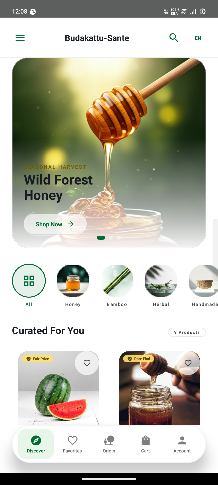
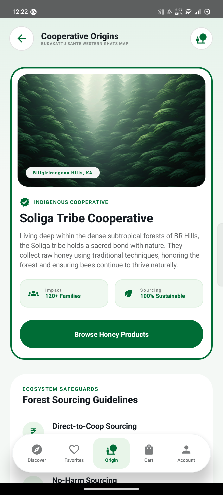
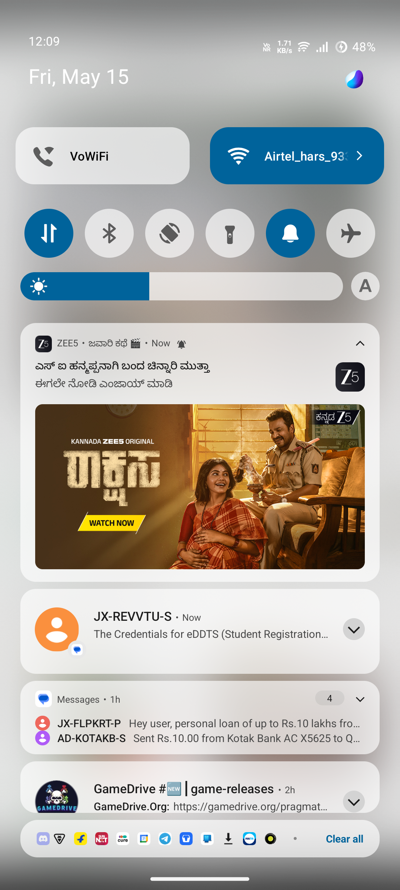
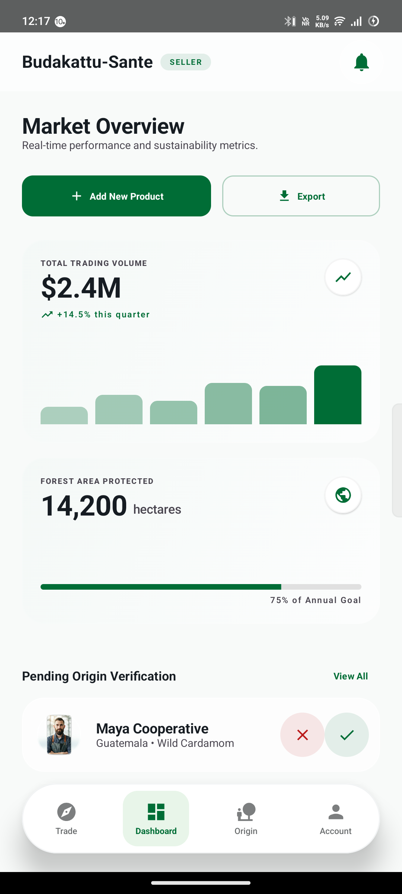
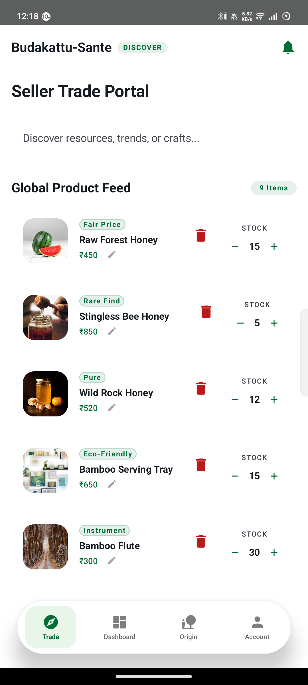

<div align="center">
  
  
  # Budakattu Sante 🌿
  **The Sovereign Indigenous Forest Marketplace**

  [](https://developer.android.com)
  [](https://kotlinlang.org)
  [](https://developer.android.com/jetpack/compose)

</div>

---

## 🌲 Introduction & Problem Statement

### The Problem
Traditional tribal artisans and forest harvesters are structurally disconnected from modern digital supply chains. Due to extreme geographic isolation, severe lack of consistent cellular coverage, and exploitative intermediaries (middlemen), they are routinely forced to sell rare, high-value forest products (like raw wild honey and heirloom bamboo crafts) at pennies on the dollar. Currently, there are zero digital commerce platforms built to handle the distinct UX constraints and network infrastructure gaps experienced by forest communities.

### The Solution
**Budakattu Sante** is a specialized, offline-first native Android ecosystem engineered to bridge this gap. It empowers traditional honey-hunters, master weavers, and organic forest farmers to digitize and showcase premium goods directly to global patrons without exploitative third parties. The platform enforces fair-trade equity and product traceability natively, building a secure digital bridge from remote forest canopies directly to conscious global consumers.

---

## ✨ Core Features

### 📡 Dual-Portal Ecosystem
Seamlessly toggles workflows based on registered identity:
- **Artisan (Seller) Dashboard:** Dynamic ledger tracking, simplified inventory control, supply pipeline management, and one-tap product digitization.
- **Patron (Buyer) Marketplace:** Hyper-premium discovery portal focusing on deep traceability, narrative-driven sourcing, and immersive visual commerce.

### 📶 Offline-First Architectural Resiliency
Engineered specifically for deep forest domains with zero reception. An integrated **SQLite/Room** persistence engine caches all local listings, incoming orders, and inventory adjustments completely offline, seamlessly queuing operations and auto-synchronizing the moment cellular coverage is re-acquired.

### 🛡️ Real-World Geotag Traceability
Every catalog listing is mapped directly back to its sourcing range—connecting patrons directly to verified harvesters in the **Western Ghats**, **Nilgiris**, and other major reserves for 100% verifiable product authenticity.

### 🤖 On-Device LLM Narrative Enrichment
Integrates localized, lightweight Large Language Models (like **Gemma 2B**) directly into the codebase. The runtime automatically optimizes simple artisan input into high-impact, premium descriptions on-device with **zero API costs and zero operational latency**.

### 🚀 Indigenous-First Design Philosophy
Uses an immersive dark-mode design with vibrant clay and forest-green palettes, elegant glassmorphism cards, and intuitive micro-animations tailored strictly for storytelling rather than generic retail grids.

---

## 🛠️ Technology Stack

Budakattu Sante is built as a pure, native Android system to ensure absolute performance, instant reactivity, and zero runtime abstraction overhead:

- **Language:** 100% Type-Safe Kotlin
- **UI Framework:** Jetpack Compose (Declarative stateless architecture)
- **Design System:** Custom Material 3 + Modular Glassmorphism rendering engine
- **Persistence Layer:**
  - **Android Jetpack DataStore:** Lightweight asynchronous preferences managing user runtime roles & locales.
  - **Room Database:** Secure, structured SQL relational architecture for local cart, listings, and order pipelines.
- **Concurrency:** Kotlin Coroutines & SharedFlow reactive state pipelines.
- **Asset Loading:** Coil (Coroutines Image Loader) with custom vector asset caching.

---

## 📦 Modules, Usage & Functionality

The application is segmented into five major functional domains, governing the complete lifecycle of tribal trading:

| Module Domain | Primary Responsibility & Usage |
| :--- | :--- |
| **Authentication Suite** | Manages secure local role registrations (Seller vs. Buyer), persisting regional profiles and locale preferences seamlessly. |
| **Artisan Ledger Engine** | Handles the Seller financial dashboards, visual revenue aggregators, real-time balance summaries, and cashout pipelines. |
| **Catalog Discovery Hub** | The main storefront engine supporting detailed product inspects, rich storytelling carousels, and verified sourcing histories. |
| **Order Persistence Pipeline** | Governs the Wishlist buffering, Shopping Cart logic, and multi-state Order Tracking engines securely offline. |
| **Local LLM Enricher** | Injects natural language processing capability directly to the device for catalog copy optimization. |

---

## 📸 Application Interface

### 🌲 Buyer Ecosystem Portal

| Discover Marketplace | Sourcing Origins Map | Sacred Wishlist |
| :---: | :---: | :---: |
|  |  |  |

### 🛠️ Tribal Seller Trade Portal

| Artisan Sales Dashboard | Seller Activity Portal | Ledger & Performance Account |
| :---: | :---: | :---: |
|  |  |  |

---

## 📂 Folder Structure

```text
.
├── app/                    # Primary Android Application Module
│   ├── src/main/
│   │   ├── assets/         # High-res embedded assets and product metadata
│   │   ├── java/.../sante/ # Pure Kotlin Source Implementations
│   │   │   ├── data/       # Local Data Management (Room Entities, DataStore, Repository)
│   │   │   ├── ui/         # UI Components & Layout Structure
│   │   │   │   ├── components/ # Reusable Atomic UI Assets (Cards, Bottom Bars, Top AppBars)
│   │   │   │   ├── navigation/ # Strongly-typed Route Controllers & Destinations
│   │   │   │   ├── screens/    # Core Page Composables (Dashboards, Tracking, Account)
│   │   │   │   └── theme/      # App Theming (Colors, Typography, Master Definitions)
│   │   │   └── MainActivity.kt # Core App Shell and Root NavHost Controller
│   │   └── res/            # Raw drawables, layout definitions, and system resources
│   └── build.gradle.kts    # Module-level build & dependency definitions
├── docs/                   # Documentation and Brand orientation assets
│   ├── screenshots/        # Clean, authentic live-device screen captures
│   └── logo.png            # Master Brand Insignia
├── gradle/                 # Wrapper properties and tooling
├── build.gradle.kts        # Global root project gradle build specifications
├── settings.gradle.kts     # Global project setting inclusions
├── gradlew.bat / gradlew   # Command line wrapper executables for build systems
└── README.md               # Master orientational project documentation manual
```

---

## ⚙️ Installation Steps

To compile, test, and deploy Budakattu Sante on your local developer workstation, please follow these prerequisites:

1.  **Cloning the Repository:**
    ```bash
    git clone https://github.com/vishnuHas/Budakatu-Sante.git
    cd Budakatu-Sante
    ```
2.  **Environment Setup:**
    - Ensure you have **JDK 17** or higher installed.
    - Verify the Android SDK is configured in your environment variables.
3.  **Device Preparation:**
    - Enable **USB Debugging** on your physical Android handset (Settings > Developer Options).
    - Alternatively, configure a Pixel AVD running API Level 30+ inside Android Studio.

---

## ▶️ Run Command

Deploy the fully compiled debug configuration to your active hardware directly from the terminal:

```powershell
# Build, sign and install debug APK via Gradle
./gradlew installDebug
```

*Note: The command automatically verifies dependencies, runs KSP compiler tasks, bundles static forest assets, and pushes the application binaries to your connected handset.*

---

## 🔗 Live Project Links
- **👨‍💻 Remote Repository:** [GitHub Codebase](https://github.com/vishnuHas/Budakatu-Sante)
- **🎥 Project Demonstration:** [Walkthrough Recording](./docs/walkthrough.md) *(Refer to docs for full UI sequence)*

---

## 🔮 Future Improvements & Roadmap

- **📶 P2P Mesh-Net Synchronization:** Leverage Wi-Fi Direct and Bluetooth Low Energy (BLE) to enable product listing propagation among harvesters, sharing data completely off-grid.
- **🔗 Immutability with Decentralized Ledgers:** Integrate light nodes for immutable fair-trade logging to guarantee zero manipulation of transaction distributions.
- **🗣️ Voice-Agnostic Cataloging:** Deploy localized, speech-to-text models supporting regional tribal dialects to allow fully spoken inventory creation for artisans.
- **🌍 Expanded Regional Localization:** Translate system strings to include further tribal dialects within the Nilgiris and Western Ghats territories.

---

<div align="center">
  Made for and inspired by the guardians of our forests.
</div>
