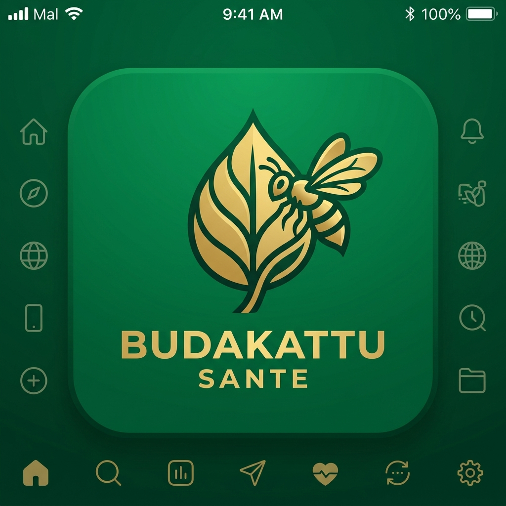
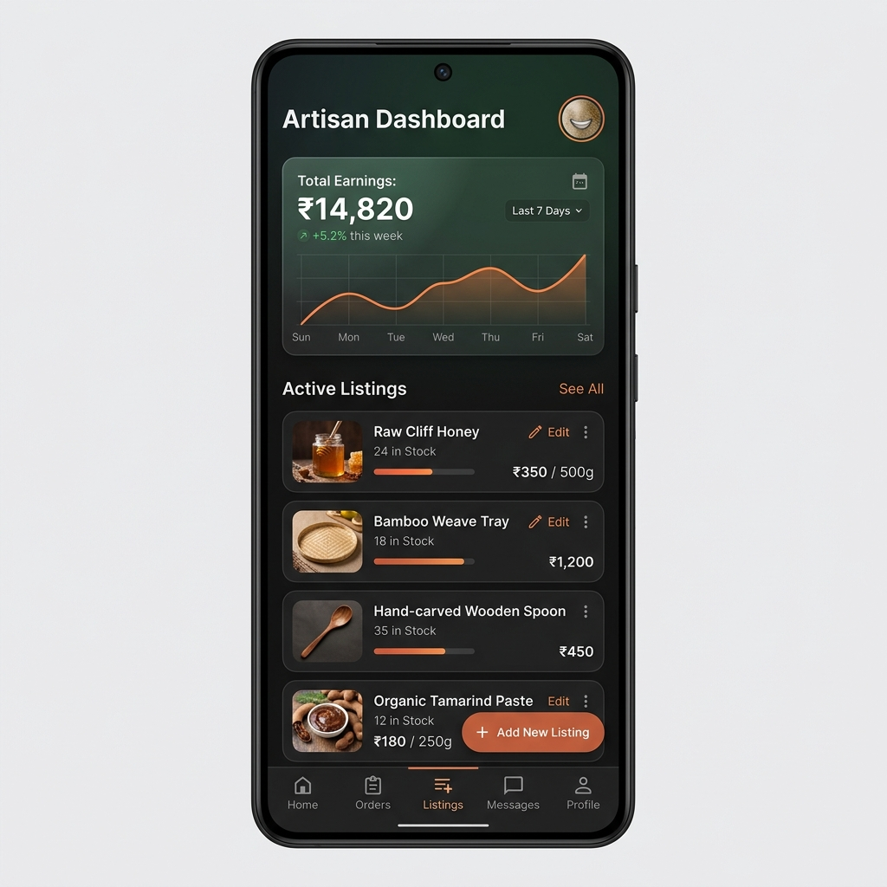
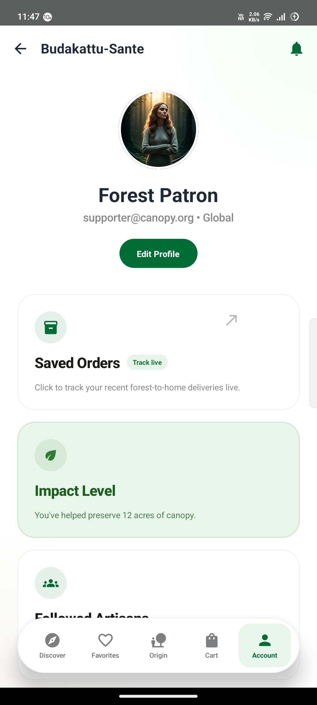

<div align="center">
  
  
  # Budakattu Sante 🌿
  **The Sovereign Indigenous Forest Marketplace**

  [](https://developer.android.com)
  [](https://kotlinlang.org)
  [](https://developer.android.com/jetpack/compose)

</div>

---

## 🌲 Introduction

**Budakattu Sante** is a revolutionary native Android application dedicated to bridging the gap between indigenous tribal communities and global consumers. It transforms remote forest economies into thriving digital ecosystems, enabling traditional honey-hunters, master weavers, and organic farmers to showcase premium, rare forest goods directly to conscious patrons without exploitative intermediaries.

Built with modern technologies, the app enforces deep-rooted cultural values into a hyper-premium digital shopping and trading experience.

## ✨ Unique & Groundbreaking Features

### 📡 Dual-Portal Ecosystem
Seamlessly switches between two dedicated user interfaces tailored perfectly for their intended workflows:
- **Artisan (Seller) Dashboard:** Simplified inventory control, trade order pipelines, direct-to-consumer pricing adjustment, and simple product digitization.
- **Patron (Buyer) Marketplace:** Premium discovery views focusing on product traceability, storytelling, and glassmorphic high-engagement visuals.

### 📶 Offline-First Architectural Resiliency
Engineered specifically for remote forest canopies with zero network reception. The application incorporates an integrated SQLite/Room persistence engine to buffer all local artisan listings, buyer orders, and inventory adjustments completely offline, ensuring frictionless commerce deep in the wild and auto-syncing once cellular coverage is re-acquired.

### 🛡️ Real-World Sourcing & Traceability
Every product is hardcoded with real location metadata connecting it back to the actual tribes in **Western Ghats**, **Nilgiris**, and beyond. Patrons get clear visibility into the specific forest ranges and communities cultivating their goods.

### 🤖 On-Device LLM Narrative Enrichment
Integrates lightweight, state-of-the-art LLM technology (such as **Gemma 2B**) for local product name optimization and automated catalog copy generation. This enhances simple artisan descriptions into premium, high-impact narratives natively on the device with zero API latency or cost.

### 🚀 Indigenous-First Commerce Design
Incorporates high-contrast, dark-mode-first aesthetics and dynamic micro-animations tailored for immersive storytelling rather than generic grid-based retail.

---

## 📸 Application Interface

| Discover Marketplace | Artisan Trade Portal | Forest Patron Account |
| :---: | :---: | :---: |
|  |  |  |

---

## 🛠️ Technology Stack

Budakattu Sante is a pure modern Android application. It relies on zero external dependencies from web prototypes to ensure maximum device performance and ultra-low latency.

- **Language:** 100% Type-Safe Kotlin
- **UI Engine:** Jetpack Compose (Stateless declarative UI logic)
- **Design Language:** Material 3 + Custom Glassmorphism overlay engine
- **Persistence Architecture:** 
  - **Android Jetpack DataStore:** Lightweight, asynchronous preferences engine managing user runtime identities and locations locally.
  - **Room Database:** Structured local relational models for product, cart, and order logic.
- **Concurrency:** Kotlin Coroutines & SharedFlow architecture for state bubbling.
- **Image Loader:** Coil (Coroutines Image Loader) with integrated vector and direct asset caching.

---

## 📦 Application Layout

```text
.
├── app/                    # Primary Android Application module
│   ├── src/main/
│   │   ├── assets/         # Embedded high-res artisan product assets
│   │   ├── java/.../sante/ # Pure Kotlin Native Implementation
│   │   │   ├── data/       # Persistence logic (DataStore, Local DB, Models)
│   │   │   ├── ui/
│   │   │   │   ├── components/ # Shared Atomic UI (GlassCard, Dialogs)
│   │   │   │   ├── navigation/ # Typed Jetpack Compose Routers
│   │   │   │   ├── screens/    # Dynamic view layouts (Buyer & Seller Dashboards)
│   │   │   │   └── theme/      # Master Design System (Typography, Theme palettes)
│   │   │   └── MainActivity.kt # Primary single-activity entrypoint
│   │   └── res/            # Compiled system XML drawables & mipmaps
│   └── build.gradle.kts    # Local module compilation configuration
├── docs/                   # Documentation & repository orientation
│   ├── screenshots/        # Validated live-device screen captures
│   └── logo.png            # Canonical brand identity insignia
├── gradle/                 # Wrapper configurations & plugins
├── build.gradle.kts        # Global project build wrapper configuration
├── gradlew.bat / gradlew   # Unix/Windows command wrapper executable binaries
└── README.md               # Sovereign project orientational manual
```

---

## 🚀 How to Run

1.  Clone the repository to your local workstation.
2.  Ensure you have **Java JDK 17+** and **Android SDK** installed.
3.  Connect an Android device or launch an emulator.
4.  Execute the build wrapper from the root directory:
    ```bash
    ./gradlew installDebug
    ```
5.  The application will auto-launch with optimized native layouts.

---

<div align="center">
  Made for and inspired by the guardians of our forests.
</div>
